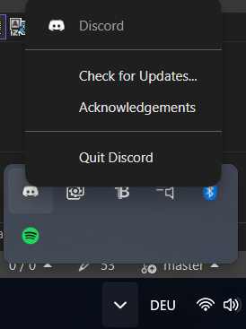

# HubCppApproach

A Windows system tray application that reads a configuration file (`AppSettings.conf`) defining scripts, displays them in a context menu, and allows the user to launch them directly from the tray icon.



## Introduction
`HubCppApproach` is a lightweight Windows application written in C++ using the Win32 API. It reads script definitions from `AppSettings.conf` and displays them in a tray icon context menu. Selecting an item will launch the corresponding executable or command. This allows quick access to frequently used scripts or tools directly from the Windows system tray.

## Features
- Runs as a hidden window with a system tray icon.
- Reads `AppSettings.conf` to dynamically populate menu items.
- Launches scripts or commands when selected.
- Supports Unicode paths via `-municode` flag.
- Allows easy addition/removal of scripts by editing the configuration file.
- Optional: custom icon via `appIcon.ico` if present.
- Auto-start capability via Windows Startup folder.

## Prerequisites
- Windows OS (tested on Windows 10/11).
- MinGW/GCC or another compiler that supports Win32 API development. Example uses `g++` with MinGW.
- C++17 or later.

## Installation

### Option 1: Download Release (Recommended)
1. Go to the [Releases](https://github.com/yourusername/ScriptHub/releases) page on GitHub.
2. Download the latest release archive (e.g., `HubCppApproach-v1.0.zip`).
3. Extract the archive to your desired location (e.g., `C:\Tools\ScriptHub\`).
4. The extracted folder should contain:
   - `HubCppApproach.exe` (main executable)
   - `AppSettings.conf` (configuration file)
   - `appIcon.ico` (optional custom icon)
   - Example scripts in `scripts/` folder

### Option 2: Clone and Build from Source
```bash
git clone https://github.com/yourusername/ScriptHub.git
cd ScriptHub
g++ HubCppApproach.cpp -municode -std=c++17 -mwindows -o HubCppApproach.exe
```

## Project Structure
```
├── HubCppApproach.cpp        # Main application source
├── HubCppApproach.exe        # Compiled executable (in releases)
├── AppSettings.conf          # Configuration file listing scripts
├── appIcon.ico               # Optional custom tray icon
├── scripts/                  # Folder containing example scripts/executables
│   ├── a.cpp                 # Example script source
│   ├── a.exe                 # Example compiled executable
│   ├── hello.cpp             # Example script source
│   ├── hello.exe             # Example compiled executable
├── Testing/                  # Test folder
│   ├── ReadTest.cpp          # Example test or utility code
│   ├── ReadTest.exe          # Compiled test executable (optional)
├── .gitignore                # Git ignore file
├── LICENSE                   # License file
└── README.md                 # This file
```

## Configuration
Edit `AppSettings.conf` to define your scripts. Example format:
```
scripts {
    "1 Script one": "scripts\a.exe"      # Path to executable or command
    "2 Script two": "scripts\hello.exe"
    "3 Script three": "yo"                # Can be any command or non-existent; behavior may vary
}
```


- The file uses a simple key-value format: `"Display Name": "Path or command"`.
- Paths should use double backslashes (`\\`) in Windows or single forward slashes (`/`) when appropriate.
- Modify/add entries as needed. The application reloads the config on launch; restart the application after editing the file.

## Compilation and Build
The project uses a single-file build without CMake. Use the compile command provided in the source comment. For example, in a MinGW environment:
```bash
g++ HubCppApproach.cpp -municode -std=c++17 -mwindows -o HubCppApproach.exe
```
- `-municode`: Enables Unicode support for Win32 API functions.
- `-std=c++17`: Uses C++17 standard.
- `-mwindows`: Builds a GUI application (no console window by default).
- `-o HubCppApproach.exe`: Output executable name.

### Compile Example Scripts
To compile example scripts in `scripts/`:
```bash
g++ scripts/a.cpp -std=c++17 -o scripts/a.exe
g++ scripts/hello.cpp -std=c++17 -o scripts/hello.exe
```

### Compile Testing Utilities
For `Testing/ReadTest.cpp`, you can compile similarly:
```bash
g++ Testing/ReadTest.cpp -std=c++17 -o Testing/ReadTest.exe
```

## Auto-Start Setup

### Method 1: Windows Startup Folder (Recommended)
To have HubCppApproach start automatically with Windows:

1. **Open the Startup folder:**
   - Press `Win + R`, type `shell:startup`, and press Enter
   - Or navigate to: `C:\Users\%USERNAME%\AppData\Roaming\Microsoft\Windows\Start Menu\Programs\Startup`

2. **Create a shortcut:**
   - Right-click in the Startup folder
   - Select "New" > "Shortcut"
   - Browse to your `HubCppApproach.exe` location (e.g., `C:\Tools\ScriptHub\HubCppApproach.exe`)
   - Click "Next" and "Finish"

3. **Alternative - Copy executable directly:**
   - Simply copy `HubCppApproach.exe` to the Startup folder
   - **Note:** Ensure `AppSettings.conf` is in the same directory as the executable

### Method 2: Registry Entry (Advanced)
For system-wide startup, add a registry entry:
```
HKEY_LOCAL_MACHINE\SOFTWARE\Microsoft\Windows\CurrentVersion\Run
```
Create a new String Value with the full path to `HubCppApproach.exe`.

### Method 3: Task Scheduler (Alternative)
Use Windows Task Scheduler to create a task that runs at startup with more advanced options like delays or specific user conditions.

## Usage
1. **Install**: Download and extract the release or clone and build from source.
2. **Configure**: Edit `AppSettings.conf` to list your desired scripts/commands.
3. **Setup Auto-Start** (Optional): Follow the [Auto-Start Setup](#auto-start-setup) section.
4. **Run**: 
   - Double-click `HubCppApproach.exe` manually, or
   - Restart Windows if you set up auto-start
5. **Interact**: Right-click (or left-click) the tray icon to display the menu of scripts. Select an item to launch the corresponding script/command.
6. **Exit**: Select "Close" from the context menu or use Task Manager if needed.

## Testing
- Test the configuration parser by editing `AppSettings.conf` and verifying menu entries appear correctly.
- Test script launching by selecting menu items and ensuring they execute properly.
- Test auto-start functionality by restarting Windows and confirming the tray icon appears.

## License
This project is licensed under the MIT License. See [LICENSE](LICENSE) for details.

## Acknowledgments
- Inspired by the need for quick script launching via system tray.
- Utilizes Win32 API for tray icon and menu management.
- Example scripts provided in `scripts/` folder.
- Designed for easy deployment and auto-start functionality.

